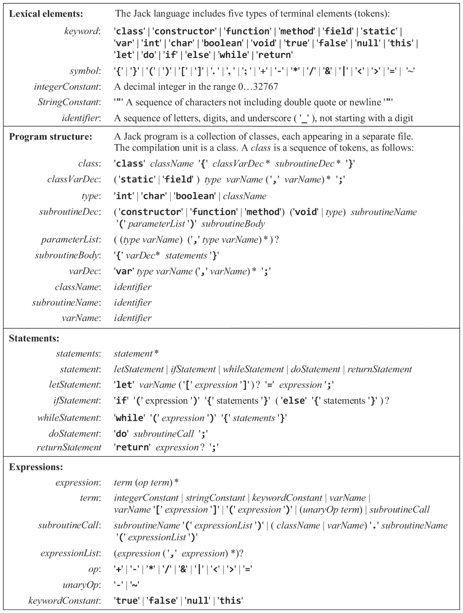

# JackComplier (Nand2Tetris Project 11)

This project implements a complier for the Jack programming language as part of Nand2Tetris Project 11. It tokenizes and parses `.jack` files, producing their VM code.

## Jack Grammar

